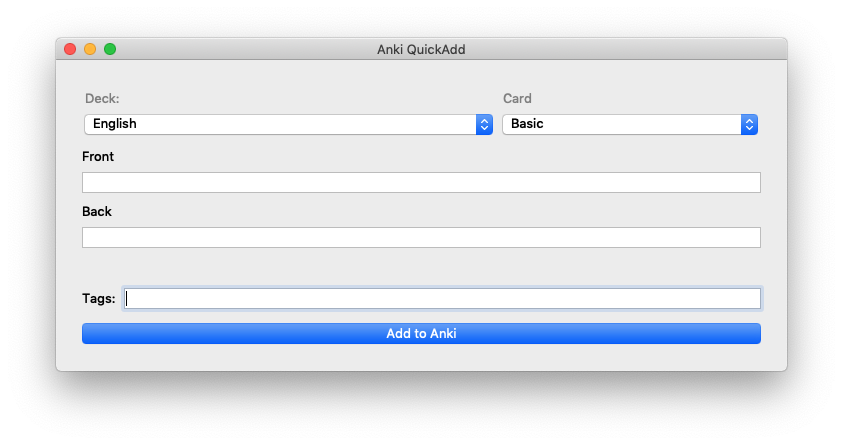
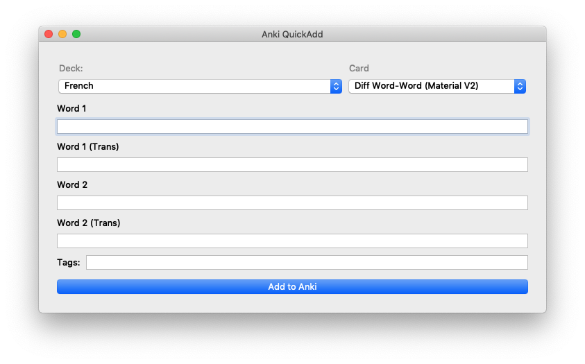

# Anki QuickAdd

A pop-up window that allows you to easily enter new Anki notes from anywhere on your computer. Requires the [AnkiConnect plugin](https://foosoft.net/projects/anki-connect/) to work properly and needs Anki to be open in the background.


On launch, it offers you dropdown menus of decks and cards from your Anki setup and allows you to enter any of the fields in any of your card types. Also supports tags, which should be separated by a space.

For ease of use, set up a keyboard shortcut on your OS to launch the Anki QuickAdd quickly, the window will persist over the top of other windows.
For example, on my mac to manage my keyboard shorcuts, I use [skhd](https://github.com/koekeishiya/skhd), so in my config I have the following, so that I can open Anki-QuickAdd from anywhere with shilf-alt-a.

```
alt - return : open -na "Terminal.app"
shift + alt - a: open -a /Applications/Anki-QuickAdd.app
...
```

## Screenshot Examples



